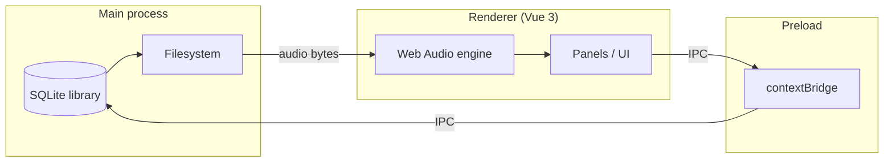

# Architecture

A high-level view of how Oscine's processes fit together.

```mermaid
flowchart LR
    subgraph Main["Main process"]
        DB[(SQLite library)]
        FS[Filesystem]
    end

    subgraph Preload["Preload"]
        Bridge[contextBridge]
    end

    subgraph Renderer["Renderer (Vue 3)"]
        UI[Panels / UI]
        Audio[Web Audio engine]
    end

    UI -->|IPC| Bridge
    Bridge -->|IPC| DB
    DB --> FS
    FS -->|audio bytes| Audio
    Audio --> UI
```
